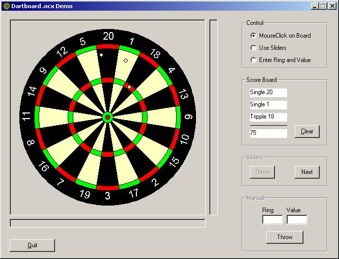



## DartBoard Control

### Description

A while ago I was developing a dart statistics program, unfortunualy sometime later I

stopped developing. But I already made an control to handle the dartboard.

It's not completly finished, I still have to add a dart throw animation

in it. But still I think it's ready for use.

Some features:

- Board is resizable

- all colors are adjustable

- all ring sizes are adjustable.

Throw dart:

- by mouse clicking on the board

- by entering the darts x,y location

- by entering the darts value.

I found it a waste of good programming to leave it on my computer without any use.

I hope some of you can use it in your own applications.

If someone can send me a good animation of a dart in flight,

I would appreciate it and I would put it in the control as well.
 
### More Info
 

             |
---                |---
**Submitted On**   |2001-06-23 16:42:28
**By**             |[D\. de Haas](https://github.com/Planet-Source-Code/PSCIndex/blob/master/ByAuthor/d-de-haas.md)
**Level**          |Advanced
**User Rating**    |5.0 (25 globes from 5 users)
**Compatibility**  |VB 6\.0
**Category**       |[Custom Controls/ Forms/  Menus](https://github.com/Planet-Source-Code/PSCIndex/blob/master/ByCategory/custom-controls-forms-menus__1-4.md)
**World**          |[Visual Basic](https://github.com/Planet-Source-Code/PSCIndex/blob/master/ByWorld/visual-basic.md)
**Archive File**   |[DartBoard 215496232001\.zip](https://github.com/Planet-Source-Code/d-de-haas-dartboard-control__1-24348/archive/master.zip)

